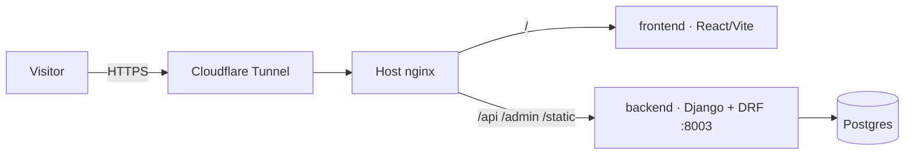

<p align="center"></p>

# YC Lobbying — Public-Affairs Management Platform

**Live:** [yclobbying.com](https://yclobbying.com)

A full-stack platform for a lobbying and public-affairs firm: Django REST API, React/Vite frontend, and container orchestration that takes a clean checkout to production with one command.

## Highlights

- **Production-grade Django + DRF backend** — environment-driven configuration (secrets, hosts, CORS origins all from `.env`), Postgres, admin workflows.
- **Modern React frontend** — Vite build, component-driven UI, proxied `/api`, `/admin`, and `/static` routes so the SPA and API share one origin.
- **Deployment as a first-class feature** — Docker Compose topology documented in `DEPLOY.md`, localhost-bound ports behind host nginx + Cloudflare Tunnel, custom domain with TLS at the edge.

## Architecture



## Run it

```bash
cp .env.example .env   # set real secrets, hosts, and origins
docker compose up -d --build
```

The frontend is exposed on `FRONTEND_PORT` and proxies `/api`, `/admin`, and `/static` to the Django backend. See `DEPLOY.md` for deployment and update commands.

---

Built by **Simon Navon** — [consulting.navonsimon.com](https://consulting.navonsimon.com)
